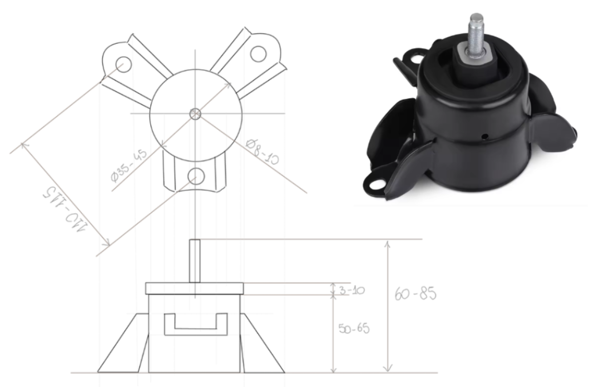
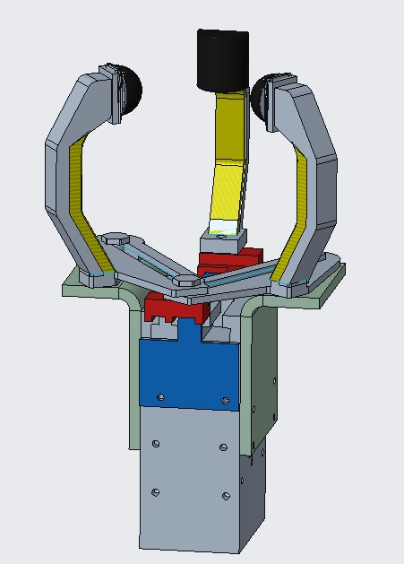
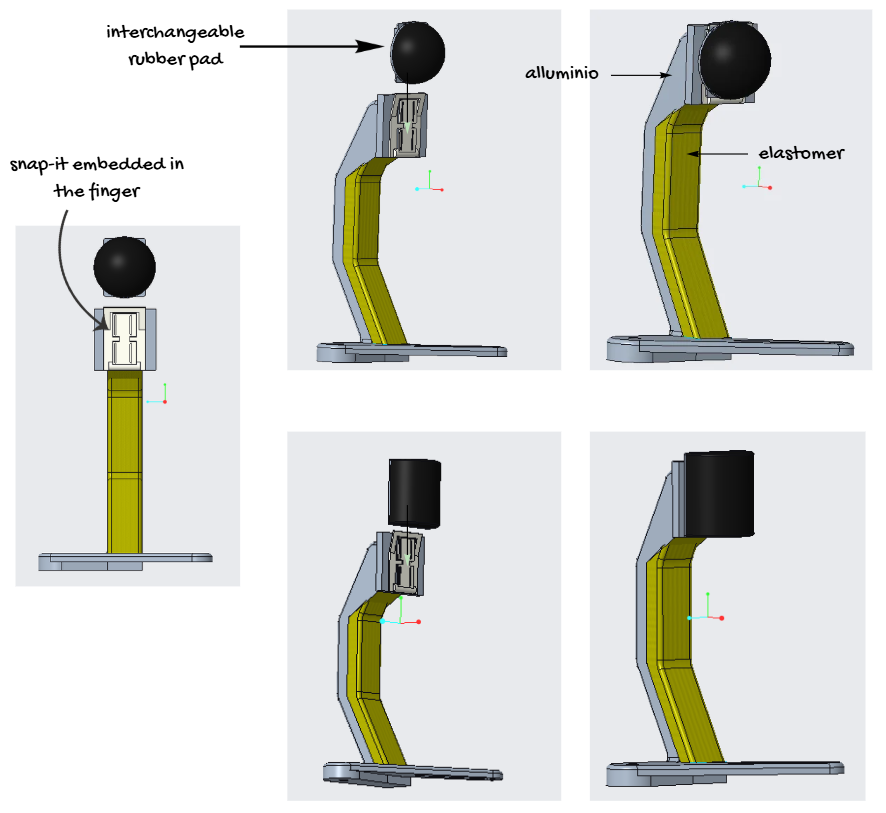
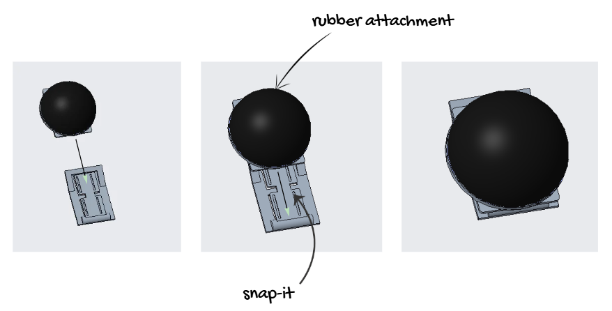

# Three-Finger Adaptive Gripper for Front Upper Motor Mount

## Project Overview
The objective of the project is to design a robotic gripper able to pick up a **front upper motor mount**. The component has a central cylindrical body, a top threaded screw and three radial flanges, also referred to as “petals”.

The main goal of the design is to create a gripper that is:
* functional;
* simple to assemble;
* adaptable to different component diameters;
* able to avoid damaging restricted areas of the component;
* suitable for integration with a Jodell motor.

## Target Component
The target component is a front upper motor mount with the following main characteristics:
* central cylindrical body;
* upper threaded screw;
* three radial flanges/petals, equally spaced at 120°;
* diameter range: approximately 35 mm to 45 mm;
* maximum height: approximately 85 mm.

The gripper must avoid contact with sensitive or restricted areas, such as:
* the threaded screw;
* the bolt sections;
* interference with the flanges.

For this reason, the selected safe grasping area is the lower cylindrical surface of the component.

  

## Design Requirements and Verification

| Requirement        | Description                                                                                 | How it is satisfied                                                                                                                                                                   |
| ------------------ | ------------------------------------------------------------------------------------------- | ------------------------------------------------------------------------------------------------------------------------------------------------------------------------------------- |
| Safe grasping      | The gripper must avoid the threaded screw, bolt sections and interference with the flanges. | The height of the fingers allows the gripper to reach the lower cylindrical surface, while the 120° movement of the fingers allows them to avoid the flanges.                         |
| Adaptability       | The gripper must be able to grasp components with different diameters.                      | The finger movement is based on the angular position of the safe areas. Since the fingers keep an angle of about 120°, the gripper can adapt to different diameters.                  |
| Stability          | The component must remain stable during the pick-up operation.                              | The use of two spherical contacts and one cylindrical contact improves stability and reduces the risk of tilting.                                                                     |
| Compliant grasping | The gripper should provide a softer and more adaptable contact with the component surface.  | The elastomer part on the fingers improves compliance along the component surface, while the rubber attachments help the fingers adapt to the local geometry during the pick-up.      |
| Easy assembly      | The design should be simple and feasible to assemble.                                       | The reduced number of components and the modular finger structure simplify the assembly process.                                                                                      |
| Maintenance        | Wearable parts should be easy to replace.                                                   | The rubber attachments are replaceable and can be changed without disassembling the whole gripper.                                                                                    |
| Compatibility      | The mechanism should be compatible with the Jodell motor and its linear sliders.            | One finger is connected to one slider and performs a linear movement, while the other two fingers are moved through rigid bars and slots connected to the second slider of the motor. |

## Final Design

The final design is based on a **three-finger architecture**.

One finger is connected to one of the motor sliders and performs a linear movement. The other two fingers are guided through rigid bars and slots, allowing them to move while maintaining the correct angular configuration around the component.

The design is based on the angular distribution of the component petals. Since the petals are considered equidistant, the gripper uses a 120° configuration to reach the safe contact areas between them.

  

## Fingers Design

The fingers are designed with two main parts:
1. **External metal structure**
   This part supports the weight of the component and provides mechanical resistance.
2. **Internal silicone/elastomer layer**
   This part improves compliance and allows a softer contact with the component.

The finger height was defined considering the tallest version of the component. Shorter components do not create critical issues, since they only generate additional clearance between the top part of the component and the gripper.

  

## Finger Tips and Rubber Attachments

Each finger includes a snap-fit system at the end, used to insert a replaceable rubber attachment.

The rubber attachments are used to:
* reduce direct metal contact;
* provide a softer contact with the component;
* improve grip stability;
* allow easier maintenance.

Two types of rubber attachments were designed:
* spherical attachments, to provide point contact;
* one cylindrical attachment, to improve stability and reduce tilting or bending movements.

The rubber parts can be replaced when worn out, without disassembling the whole gripper.

  

## Authors
This project was developed as a collaborative group project for the Mechanical Design Methods in Robotics course.

   
  &nbsp;&nbsp;&nbsp;&nbsp;
  
  &nbsp;&nbsp;&nbsp;&nbsp;
   

